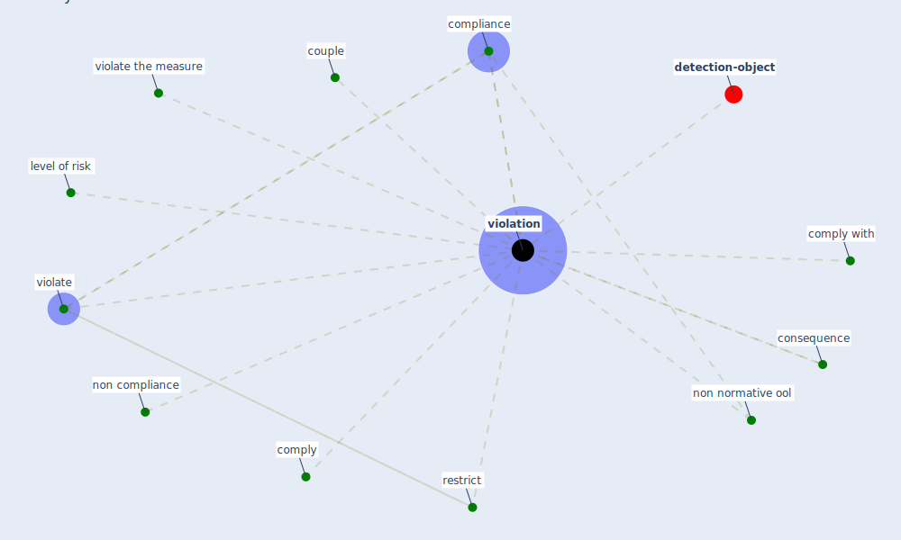

# Keyword: violation

* [detection-object](cluster_8)

## Keywords

 * Cluster_8, [compliance](keyword_compliance), comply, comply with, consequence, couple, level of risk, non compliance, non normative ool, restrict, violate, violate the measure, [violation](keyword_violation), violations

## Mapping

## Neighbours

### Closest articles

* Compliance with COVID-19 Mitigation Measures in the United States - [LINK](article_van_rooij_compliance_2020)
* The Intelligent Lockdown: Compliance with COVID-19 Mitigation Measures in the Netherlands - [LINK](article_kuiper_intelligent_2020)
* Impact of Covid-19 on the built environment - [LINK](article_mahima_impact_2022)
* DeepSOCIAL: Social Distancing Monitoring and Infection Risk Assessment in COVID-19 Pandemic - [LINK](article_rezaei_deepsocial_2020)
* Towards the sustainable development of smart cities through mass video surveillance: A response to the COVID-19 pandemic - [LINK](article_shorfuzzaman_towards_2021)

### Closest BPs

