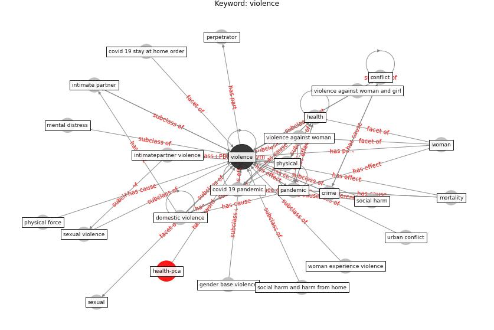

# Keyword: violence

* [health-pca](cluster_Cluster_9)

## Keywords

 * Cluster_9, conflict, [covid 19 pandemic](keyword_covid_19_pandemic), covid 19 stay at home order, crime, domestic violence, gender base violence, [health](keyword_health), intimate partner, intimatepartner violence, mental distress, [mortality](keyword_mortality), [pandemic](keyword_pandemic), perpetrator, [physical](keyword_physical), physical force, sexual, sexual violence, [social harm](keyword_social_harm), social harm and harm from home, urban conflict, [violence](keyword_violence), violence against woman, violence against woman and girl, [woman](keyword_woman), woman experience violence

## Concepts

 

## Neighbours

### Closest articles

* COVID-19 and the rise of intimate partner violence - [LINK](article_aguero_covid-19_2021)
* Dangerous liaisons? Applying the social harm perspective to the social inequality, housing and health trifecta during the Covid-19 pandemic - [LINK](article_gurney_dangerous_2021)
* The Emergence of Anti-Privacy and Control at the Nexus between the Concepts of Safe City and Smart City - [LINK](article_allam_emergence_2019)
* How is COVID-19 Experience Transforming Sustainability Requirements of Residential Buildings? A Review - [LINK](article_tokazhanov_how_2020)
* Health, Economic and Social Development Challenges of the COVID-19 Pandemic: Strategies for Multiple and Interconnected Issues - [LINK](article_panneer_health_2022)
* COVID-19: IMPACT OF THE PANDEMIC ON THE SUSTAINABLE DEVELOPMENT GOALS - [LINK](article_samout_covid-19_2020)
* How COVID-19 Could Accelerate the Adoption of New Retail Technologies and Enhance the (E-)Servicescape - [LINK](article_willems_how_2021)
* The Role of Architecture and Urbanism in Preventing Pandemics - [LINK](article_kumar_role_2021)

### Closest BPs

