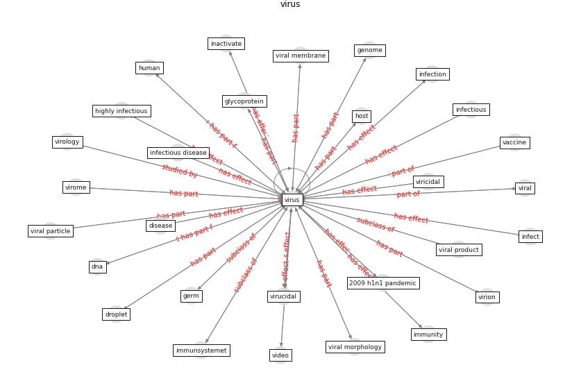

# Keyword: virus

* [health-patient](cluster_Cluster_2)

* [wastewater-sars](cluster_Cluster_4)

* [air-ventilation](cluster_Cluster_14)

## Keywords

 * 2009 h1n1 pandemic, adenovirus, [aerosol](keyword_aerosol), [airborne](keyword_airborne), airborne transmission, anti influenza, antibodie, [antimicrobial](keyword_antimicrobial), [antiviral](keyword_antiviral), antivirus, [bacteria](keyword_bacteria), bombeflyene, bunyaviridae, cell, contact, contagion, [copper](keyword_copper), coronaviridae, [coronavirus](keyword_coronavirus), coronavirus disease, [covid 19 pandemic](keyword_covid_19_pandemic), covid 19 virus, [covid-19](keyword_covid-19), covs, deactivate, [detection](keyword_detection), direct contraction, [disease](keyword_disease), dna, [droplet](keyword_droplet), ebola, eksponeringsniveau, enteric, envelop, [epidemic](keyword_epidemic), [epidemiological](keyword_epidemiological), flaviviridae, flu, genetic material, [genome](keyword_genome), germ, h1n1, host, immunsystemet, inactivate, inactivation, infect, [infection](keyword_infection), infectious, [infectious disease](keyword_infectious_disease), infectious influenza, infective, infectivity, [influenza](keyword_influenza), [influenza virus](keyword_influenza_virus), influenza, lipid, [microorganism](keyword_microorganism), mutate, noroviru, nuclei, nucleic acid, [outbreak](keyword_outbreak), [pandemic](keyword_pandemic), [particle](keyword_particle), [pathogen](keyword_pathogen), person to person transmission, propagation, protein, quanta correlation, rapid testing, respiratory droplet, ribonucleic acid, [rna](keyword_rna), [sar cov 1](keyword_sar_cov_1), [sar cov 2](keyword_sar_cov_2), [sar cov2](keyword_sar_cov2), severe acute respiratory syndrome, sneeze, [spread](keyword_spread), [surface](keyword_surface), surface transmission, survival, titer, [transmission](keyword_transmission), transmit, type, [vaccine](keyword_vaccine), [vector](keyword_vector), [viral](keyword_viral), virion, virology, virome, virucidal, [virus](keyword_virus), virus particle, virus propagation, virus stock suspension, [zika](keyword_zika), zoonotic

## Concepts

 

## Neighbours

### Closest articles

* Mechanistic insights into the effect of humidity on airborne influenza virus survival, transmission and incidence - [LINK](article_marr_mechanistic_2019)
* Graphene-based nanomaterials as antimicrobial surface coatings: A parallel approach to restrain the expansion of COVID-19 - [LINK](article_ayub_graphene-based_2021)
* The effect of occupant distribution on energy consumption and COVID-19 infection in buildings: A case study of university building - [LINK](article_mokhtari_effect_2021)
* A Comprehensive Review of the COVID-19 Pandemic and the Role of IoT, Drones, AI, Blockchain, and 5G in Managing its Impact - [LINK](article_chamola_comprehensive_2020)
* Designing a Multi-Agent Occupant Simulation System to Support Facility Planning and Analysis for COVID-19 - [LINK](article_lee_designing_2021)
* Designing Post COVID-19 Buildings: Approaches for Achieving Healthy Buildings - [LINK](article_navaratnam_designing_2022)
* A Review on Building Design as a Biomedical System for Preventing COVID-19 Pandemic - [LINK](article_amran_review_2022)
* The ventilation of buildings and other mitigating measures for COVID-19: a focus on wintertime - [LINK](article_burridge_ventilation_2021)
* COVID-19 Could Leverage a Sustainable Built Environment - [LINK](article_pinheiro_covid-19_2020)
* COVID-19 Experience Transforming the Protective Environment of Office Buildings and Spaces - [LINK](article_phapant_covid-19_2021)

### Closest BPs

