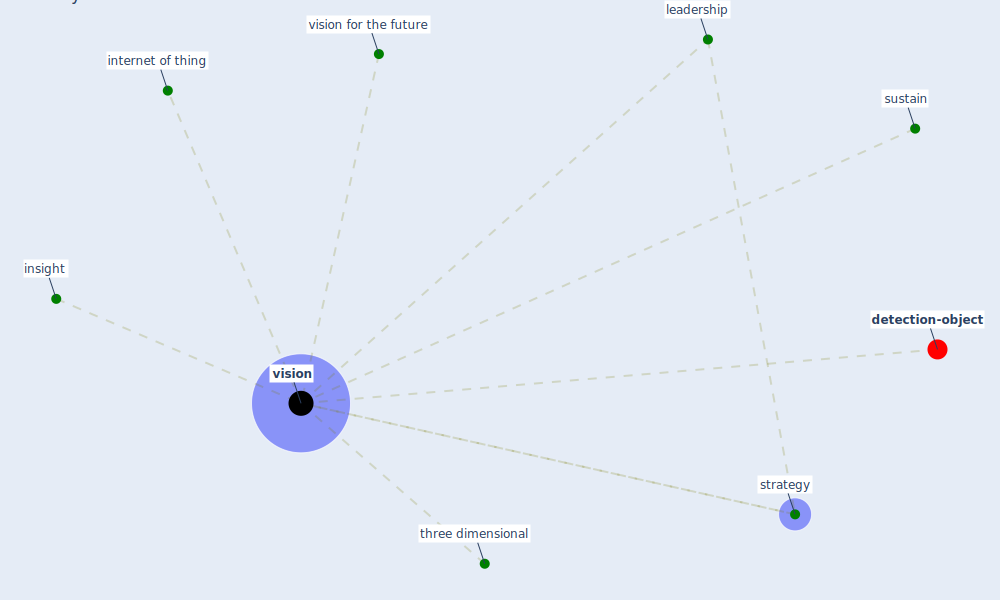

# Keyword: vision

* [detection-object](cluster_8)

## Keywords

 * Cluster_8, insight, [internet of thing](keyword_internet_of_thing), leadership, strategy, sustain, three dimensional, [vision](keyword_vision), vision for the future, visions

## Mapping

## Neighbours

### Closest articles

* Urban planning after COVID-19 - [LINK](article_rtpi_urban_2021)
* How COVID-19 Could Accelerate the Adoption of New Retail Technologies and Enhance the (E-)Servicescape - [LINK](article_willems_how_2021)
* Biophilic design in architecture and its contributions to health, well-being, and sustainability: A critical review - [LINK](article_zhong_biophilic_2022)
* Designing a Multi-Agent Occupant Simulation System to Support Facility Planning and Analysis for COVID-19 - [LINK](article_lee_designing_2021)
* Pandemic Analytics: How Countries are Leveraging Big Data Analytics and Artificial Intelligence to Fight COVID-19? - [LINK](article_mehta_pandemic_2021)
* Continuous IEQ monitoring system: Context and development - [LINK](article_parkinson_continuous_2019)

### Closest BPs

