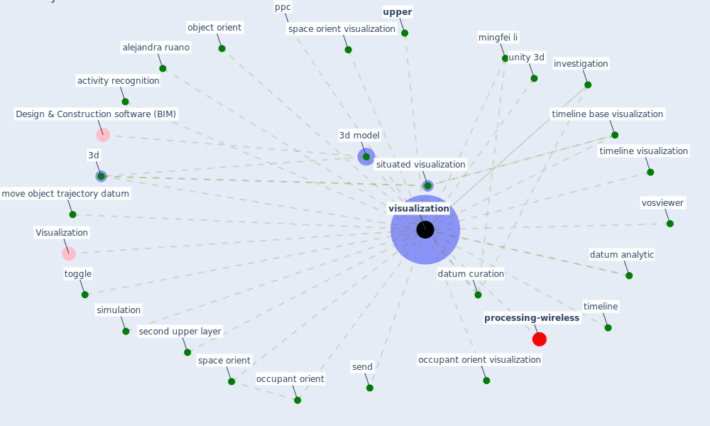

# Keyword: visualization

* [processing-wireless](cluster_14)

## Keywords

 * 3d, 3d model, Cluster_14, Visualization, activity recognition, alejandra ruano, [analysis](keyword_analysis), citation mapping, computer animation, conceptualization, datum analytic, datum curation, graphical, investigation, invoke, jintao, jintao hu, [mapping](keyword_mapping), maría alejandra ruano, mingfei li, move object trajectory, move object trajectory datum, object orient, occupant orient, occupant orient visualization, ppc, second upper layer, send, [simulation](keyword_simulation), situated visualization, space orient, space orient visualization, timeline, timeline base visualization, timeline visualization, toggle, unity 3d, [upper](keyword_upper), [visualization](keyword_visualization), visualizations, vosviewer, yalong wang

## Mapping

## Neighbours

### Closest articles

* Designing a Multi-Agent Occupant Simulation System to Support Facility Planning and Analysis for COVID-19 - [LINK](article_lee_designing_2021)
* Current knowledge of COVID-19: Advances, challenges and future perspectives - [LINK](article_wu_current_2021)
* Social distancing enhanced automated optimal design of physical spaces in the wake of the COVID-19 pandemic - [LINK](article_ugail_social_2021)
* Scalable IoT Architecture for Monitoring IEQ Conditions in Public and Private Buildings - [LINK](article_calvo_scalable_2022)
* Detection of SARS-CoV-2 in raw and treated wastewater in Germany – Suitability for COVID-19 surveillance and potential transmission risks - [LINK](article_westhaus_detection_2021)
* COVID-ABS: An agent-based model of COVID-19 epidemic to simulate health and economic effects of social distancing interventions - [LINK](article_silva_covid-abs_2020)
* Digital Twin of COVID-19 Mass Vaccination Centers - [LINK](article_pilati_digital_2021)
* Mitigation strategies and compliance in the COVID-19 fight; how much compliance is enough? - [LINK](article_mukerjee_mitigation_2021)
* Designing Post COVID-19 Buildings: Approaches for Achieving Healthy Buildings - [LINK](article_navaratnam_designing_2022)
* Indirect effects of COVID-19 on the environment - [LINK](article_zambrano-monserrate_indirect_2020)

### Closest BPs

