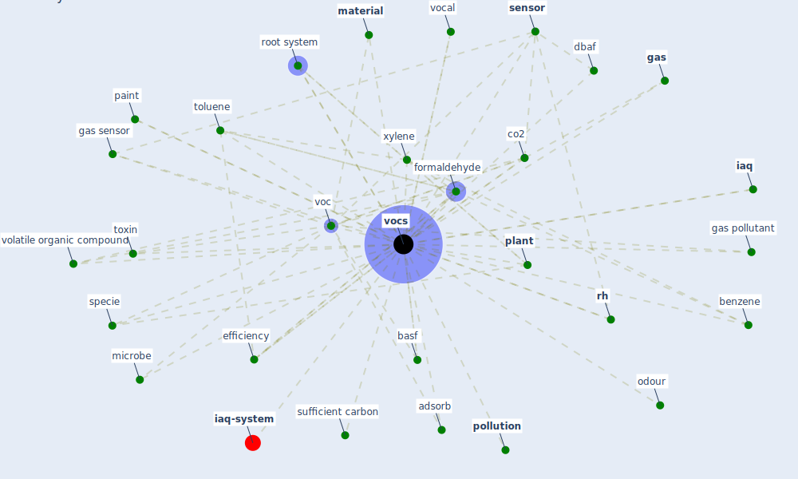

# Keyword: vocs

* [iaq-system](cluster_3)

## Keywords

 * Cluster_3, adsorb, atmospheric sensor, basf, benzene, carbon, co2, [construction](keyword_construction), consumption, [dbaf](keyword_dbaf), degradation, efficiency, ethylbenzene, [formaldehyde](keyword_formaldehyde), [gas](keyword_gas), gas pollutant, gas sensor, [iaq](keyword_iaq), [indoor](keyword_indoor), indoor air, [level](keyword_level), [material](keyword_material), microbe, microchip, [noise](keyword_noise), odour, paint, [plant](keyword_plant), [pollution](keyword_pollution), [rh](keyword_rh), root system, [sensor](keyword_sensor), specie, sufficient carbon, [toluene](keyword_toluene), toxin, voc, vocal, [vocs](keyword_vocs), volatile organic compound, xylene

## Mapping

## Neighbours

### Closest articles

* Characterization and performance evaluation of a full-scale activated carbon-based dynamic botanical air filtration system for improving indoor air quality - [LINK](article_wang_characterization_2011)
* A comprehensive review on indoor air quality monitoring systems for enhanced public health - [LINK](article_saini_comprehensive_2020)
* Health, Wellbeing \& Productivity in Offices - [LINK](article_world_green_building_council_health_2014)
* Methods for air cleaning and protection of building occupants from airborne pathogens - [LINK](article_bolashikov_methods_2009)
* Smart buildings: how a virus might lead to healthier buildings - Arup - [LINK](article_lam_smart_2021)
* Indoor Air Quality: Rethinking rules of building design strategies in post-pandemic architecture - [LINK](article_megahed_indoor_2021)
* Designing Post COVID-19 Buildings: Approaches for Achieving Healthy Buildings - [LINK](article_navaratnam_designing_2022)
* Occupant health in buildings: Impact of the COVID-19 pandemic on the opinions of building professionals and implications on research - [LINK](article_awada_occupant_2022)
* Readiness Assessment of Green Building Certification Systems for Residential Buildings during Pandemics - [LINK](article_tleuken_readiness_2021)

### Closest BPs

