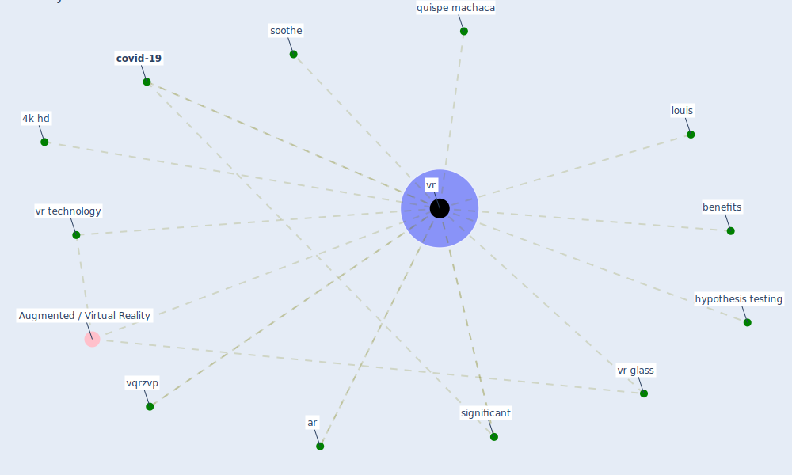

# Keyword: vr

## Keywords

 * 4k hd, Augmented / Virtual Reality, ar, benefits, [covid-19](keyword_covid-19), hypothesis testing, louis, quispe machaca, significant, soothe, vqrzvp, [vr](keyword_vr), vr glass, vr technology

## Mapping

## Neighbours

### Closest articles

* Significant applications of virtual reality for COVID-19 pandemic - [LINK](article_singh_significant_2020)
* Future (post-COVID) digital, smart and sustainable cities in the wake of 6G: Digital twins, immersive realities and new urban economies - [LINK](article_allam_future_2021)
* Design COVID-19 Ontology: A Healthcare and Safety Perspective - [LINK](article_aloulou_design_2022)
* Addressing vulnerability, building resilience: community-based adaptation to vector-borne diseases in the context of global change - [LINK](article_bardosh_addressing_2017)
* A Platform for Citizen Cooperation during the COVID-19 Pandemic in RN, Brazil - [LINK](article_de_araujo_platform_2020)
* How the 5G Enabled the COVID-19 Pandemic Prevention and Control: Materiality, Affordance, and (De-)Spatialization - [LINK](article_li_how_2022)
* How COVID-19 Could Accelerate the Adoption of New Retail Technologies and Enhance the (E-)Servicescape - [LINK](article_willems_how_2021)

### Closest BPs

