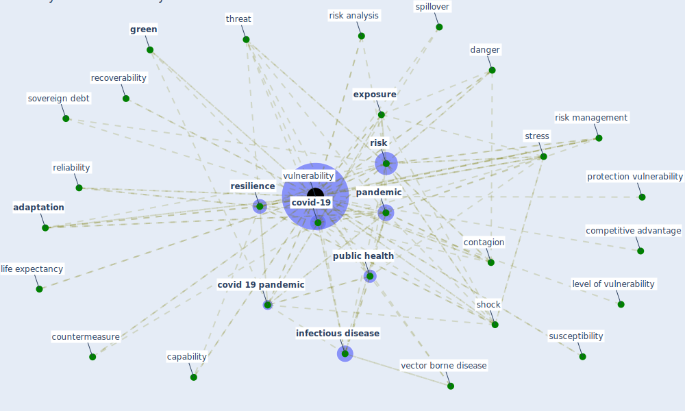

# Keyword: vulnerability

## Keywords

 * [adaptation](keyword_adaptation), adaptation to climate change, adaptivity, awareness, banking system, [build environment](keyword_build_environment), capability, challenge, competitive advantage, concept, consumer feedback, contagion, countermeasure, [covid 19 pandemic](keyword_covid_19_pandemic), [covid-19](keyword_covid-19), [cyberchondria](keyword_cyberchondria), danger, [danger model](keyword_danger_model), deprivation, [energy](keyword_energy), enterprise, [epidemic](keyword_epidemic), [exposure](keyword_exposure), [factor](keyword_factor), financially, financially vulnerable, food insecurity, fragility, gpsjamme, [green](keyword_green), hack, hazard, inequality, [infection](keyword_infection), [infectious disease](keyword_infectious_disease), infectious disease spread, [infrastructure](keyword_infrastructure), insecurity, level of vulnerability, life expectancy, love, [network](keyword_network), [pandemic](keyword_pandemic), perception, poverty, previous health condition, protection vulnerability, [public health](keyword_public_health), public space governance, recoverability, reliability, [resilience](keyword_resilience), resiliency, resilient entity, response vulnerability, [risk](keyword_risk), risk analysis, risk management, robbery, role, [sector](keyword_sector), [security](keyword_security), security mechanism, security threat, severity, [shock](keyword_shock), sovereign debt, specific, spillover, stock take, [stress](keyword_stress), stress test, [supply chain](keyword_supply_chain), survival, suscepti bility, susceptibilitie, susceptibility, systemic gap, tenure insecurity, threat, threshold host density, threshold host density10, transmission risk, trust, unsustainable, unsustainable pattern of development, validity, validity challenge, vbds, [vector borne disease](keyword_vector_borne_disease), virus exposure, vulnerabilities, [vulnerability](keyword_vulnerability), vulnerability during a pandemic, vulnerability in scone, vulnerability measure, vulnerable, weak point, [workplace](keyword_workplace), wounded

## Mapping

## Neighbours

### Closest articles

* Addressing vulnerability, building resilience: community-based adaptation to vector-borne diseases in the context of global change - [LINK](article_bardosh_addressing_2017)
* A review of definitions and measures of system resilience - [LINK](article_hosseini_review_2016)
* Preparing critical infrastructure for the future: Lessons learnt from the Covid-19 pandemic - [LINK](article_tomalska_preparing_2022)
* COVID-19 Could Leverage a Sustainable Built Environment - [LINK](article_pinheiro_covid-19_2020)
* COVID19-Routes: A Safe Pedestrian Navigation Service - [LINK](article_cantarero_covid19-routes_2021)
* Learning from pandemics: Applying resilience thinking to identify priorities for planning urban settlements - [LINK](article_syal_learning_2021)
* World Bank Development Report - [LINK](article_world_bank_world_2022)
* Strengthening resilience: a priority shared by Health 2020 and - [LINK](article_who_strengthening_2017)
* Urban planning after COVID-19 - [LINK](article_rtpi_urban_2021)
* COVID-19 and a new resilient infrastructure landscape - [LINK](article_oecd_covid-19_2021)

### Closest BPs

