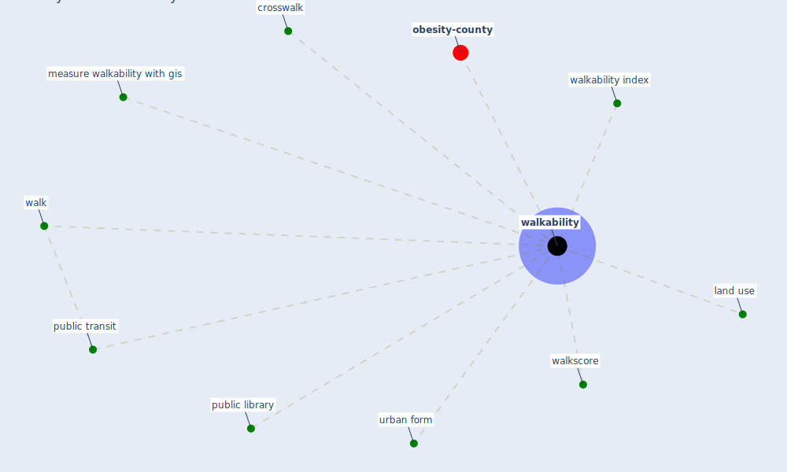

# Keyword: walkability

* [obesity-county](cluster_9)

## Keywords

 * Cluster_9, crosswalk, land use, measure walkability with gis, public library, public transit, urban form, walk, [walkability](keyword_walkability), walkability index, walkscore

## Mapping

## Neighbours

### Closest articles

* Treating two pandemics for the price of one: Chronic and infectious disease impacts of the built and natural environment - [LINK](article_frank_treating_2021)
* Urban planning after COVID-19 - [LINK](article_rtpi_urban_2021)
* Association of built environment attributes with the spread of COVID-19 at its initial stage in China - [LINK](article_li_association_2021)
* The impact of the COVID-19 pandemic on the importance of urban green spaces to the public - [LINK](article_noszczyk_impact_2022)
* Health, Wellbeing \& Productivity in Offices - [LINK](article_world_green_building_council_health_2014)

### Closest BPs

