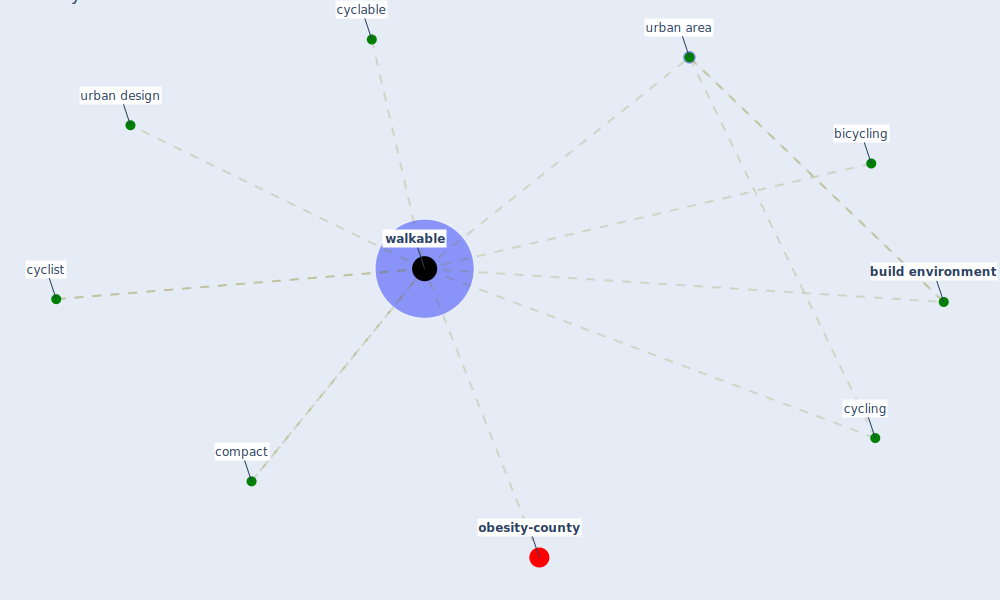

# Keyword: walkable

* [obesity-county](cluster_9)

## Keywords

 * Cluster_9, bicycling, [build environment](keyword_build_environment), compact, cyclable, [cycling](keyword_cycling), cyclist, urban area, urban design, [walkable](keyword_walkable)

## Mapping

## Neighbours

### Closest articles

* Treating two pandemics for the price of one: Chronic and infectious disease impacts of the built and natural environment - [LINK](article_frank_treating_2021)
* Impact of Covid-19 on the built environment - [LINK](article_mahima_impact_2022)
* How is COVID-19 Experience Transforming Sustainability Requirements of Residential Buildings? A Review - [LINK](article_tokazhanov_how_2020)
*  - [LINK](article_dalessandro_covid-19_2020)
* The Role of Architecture and Urbanism in Preventing Pandemics - [LINK](article_kumar_role_2021)
* Antivirus-built environment: Lessons learned from Covid-19 pandemic - [LINK](article_megahed_antivirus-built_2020)

### Closest BPs

