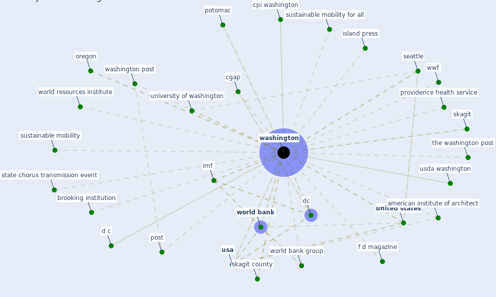

# Keyword: washington

## Keywords

 * american institute of architect, asm press, associate press, brooking institution, caa, cgap, chorus transmission event, cpi washington, d c, dc, f d magazine, finreglab, g30, gallaudet university, har besøgt imf i washington, humannature connection, imf, imf f d magazine, island press, oregon, outbreak investigation, [pandemic](keyword_pandemic), post, potomac, potomac associate book, providence health, providence health service, seattle, skagit, skagit county, [state](keyword_state), state chorus transmission event, sustainable mobility, sustainable mobility for all, the washington post, [united states](keyword_united_states), united states of america, university of washington, [usa](keyword_usa), usda washington, [washington](keyword_washington), washington post, [world bank](keyword_world_bank), world bank group, world resources institute, world wildlife fund, wwf

## Mapping

## Neighbours

### Closest articles

* World Bank Development Report - [LINK](article_world_bank_world_2022)
* Urban planning after COVID-19 - [LINK](article_rtpi_urban_2021)
* Environmental factors involved in SARS-CoV-2 transmission: effect and role of indoor environmental quality in the strategy for COVID-19 infection control - [LINK](article_azuma_environmental_2020)
* ASHRAE Position Document on Infectious Aerosols - [LINK](article_ashrae_ashrae_2022)
* Continuous IEQ monitoring system: Context and development - [LINK](article_parkinson_continuous_2019)
* COVID-19 Prevention and Control Measures in Workplace Settings: A Rapid Review and Meta-Analysis - [LINK](article_ingram_covid-19_2021)
* Heating, ventilation and air-conditioning systems in the context of COVID-19 - [LINK](article_ecdc_heating_2020)
* Pandemic Analytics: How Countries are Leveraging Big Data Analytics and Artificial Intelligence to Fight COVID-19? - [LINK](article_mehta_pandemic_2021)
* A critical analysis of the impacts of COVID-19 on the global economy and ecosystems and opportunities for circular economy strategies - [LINK](article_ibn-mohammed_critical_2021)
* How COVID-19 Could Accelerate the Adoption of New Retail Technologies and Enhance the (E-)Servicescape - [LINK](article_willems_how_2021)

### Closest BPs

