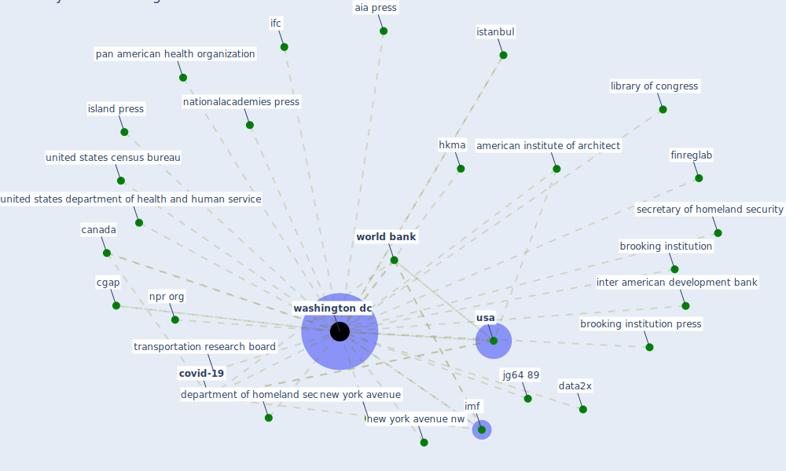

# Keyword: washington dc

## Keywords

 * 1155 sixteenth street, aia press, american academy of art and science, american association, american association for the advancement of science, american institute of architect, american institute of architect press, american public health association, american society of microbiology, american university, beatley, beatley t, brooking institution, brooking institution press, build owner and manager association international, caa, [canada](keyword_canada), carnegie endowment, cgap, [covid-19](keyword_covid-19), cybersecurity infrastructure security agency, data2x, department of homeland security, design museum of the america, epa, finreglab, g30, [government](keyword_government), government printing office, hkma, humannature connection, ida, ifc, imf, inter american development bank, internationalmonetary fund, island press, istanbul, jg64, jg64 89, latin america, library of congress, medina, museum of modern art, nationalacademies press, new york avenue, new york avenue nw, npr, npr org, nw, office of the director, pan american health organization, public health report, sbn sustainable banking network, sbp state bank of pakistan, sec, secretary of homeland security, smithsonian institution, tambunan, the nationalacademie press, transportation research board, united states census bureau, united states department of health and human service, university of washington, [usa](keyword_usa), usdot, usdot gov, [washington dc](keyword_washington_dc), washington post, [world bank](keyword_world_bank), world bank group, world government center, world headquarter

## Mapping

## Neighbours

### Closest articles

* World Bank Development Report - [LINK](article_world_bank_world_2022)
* The Impact of COVID-19 on Public Space: A Review of the Emerging Questions - [LINK](article_honey-roses_impact_2020)
* Challenges to Mitigating the Urban Health Burden of Mosquito-Borne Diseases in the Face of Climate Change - [LINK](article_ligsay_challenges_2021)
* Preparing critical infrastructure for the future: Lessons learnt from the Covid-19 pandemic - [LINK](article_tomalska_preparing_2022)
* The Emergence of Anti-Privacy and Control at the Nexus between the Concepts of Safe City and Smart City - [LINK](article_allam_emergence_2019)
* A review of definitions and measures of system resilience - [LINK](article_hosseini_review_2016)
* Strategies to Mitigate COVID-19 Pandemic Impacts on Health and Safety of Workers in Construction Projects - [LINK](article_kaushal_strategies_2021)
* ASHRAE Position Document on Infectious Aerosols - [LINK](article_ashrae_ashrae_2022)
* The Role of Architecture and Urbanism in Preventing Pandemics - [LINK](article_kumar_role_2021)
* COVID-19: IMPACT OF THE PANDEMIC ON THE SUSTAINABLE DEVELOPMENT GOALS - [LINK](article_samout_covid-19_2020)

### Closest BPs

