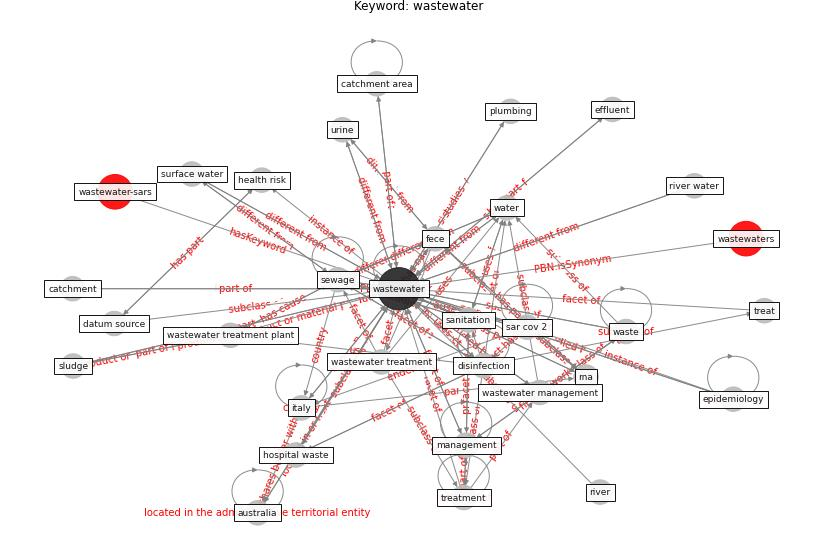

# Keyword: wastewater

* [wastewater-sars](cluster_Cluster_2)

* [ieq-building](cluster_Cluster_11)

## Keywords

 * args, [australia](keyword_australia), b2, bioindicator, brie, bsl 3, catchment, catchment area, catchment population, centrifugation, composition, confirmation, ct, ct 38, ct38, datum source, discharge, [disinfection](keyword_disinfection), drink water, drinkable water, dutch city, effluent, effluent, effluent water, electropositive membrane, [environment](keyword_environment), [epidemiology](keyword_epidemiology), esri arcgis, excreta, fece, health risk, human waste, insewer, [italy](keyword_italy), management, matrix, monitoring of illicit drug consumption, outfall, [pcr](keyword_pcr), pcr inhibitor, phns, plumbing, potato chip, [product](keyword_product), [qpcr](keyword_qpcr), reclaimed water reuse, river, river water, [rna](keyword_rna), rt qpcr, [sample](keyword_sample), [sanitation](keyword_sanitation), [sar cov 2](keyword_sar_cov_2), sediment, [sewage](keyword_sewage), sewage pipe, sewage system, sewage treatment plant, sewer, sludge, soil, solid waste, stormflow, supernatant, surface water, [surveillance](keyword_surveillance), [temperature](keyword_temperature), testing, titer, [transmission](keyword_transmission), treat, treat sewage, treatment, treatment catchment basin, treatment facility, treatment plant, untreated, [urban](keyword_urban), urine, [waste](keyword_waste), waste collection, [wastewater](keyword_wastewater), wastewater day, wastewater drainage, wastewater in australia, wastewater management, wastewater matrix, wastewater pollution, wastewater pump, wastewater surveillance, wastewater treatment, wastewater treatment plant, wastewater treatment system, wastewaterreatment, [water](keyword_water), water fingerprinting, water quality, water source, [wwtp](keyword_wwtp), flow

## Concepts

 

## Neighbours

### Closest articles

* Detection of SARS-CoV-2 in raw and treated wastewater in Germany – Suitability for COVID-19 surveillance and potential transmission risks - [LINK](article_westhaus_detection_2021)
* Future perspectives of wastewater-based epidemiology: Monitoring infectious disease spread and resistance to the community level - [LINK](article_sims_future_2020)
* First confirmed detection of SARS-CoV-2 in untreated wastewater in Australia: A proof of concept for the wastewater surveillance of COVID-19 in the community - [LINK](article_ahmed_first_2020)
* Computational analysis of SARS-CoV-2/COVID-19 surveillance by wastewater-based epidemiology locally and globally: Feasibility, economy, opportunities and challenges - [LINK](article_hart_computational_2020)
* Disinfection technology of hospital wastes and wastewater: Suggestions for disinfection strategy during coronavirus Disease 2019 (COVID-19) pandemic in China - [LINK](article_wang_disinfection_2020)
* SARS-CoV-2 Titers in Wastewater Are Higher than Expected from Clinically Confirmed Cases - [LINK](article_wu_sars-cov-2_2020)
* How is COVID-19 Experience Transforming Sustainability Requirements of Residential Buildings? A Review - [LINK](article_tokazhanov_how_2020)
* SARS-CoV-2 RNA in wastewater anticipated COVID-19 occurrence in a low prevalence area - [LINK](article_randazzo_sars-cov-2_2020)
* When the fourth water and digital revolution encountered COVID-19 - [LINK](article_poch_when_2020)
* An environmental and health perspective for COVID-19 outbreak: Meteorology and air quality influence, sewage epidemiology indicator, hospitals disinfection, drug therapies and recommendations - [LINK](article_barcelo_environmental_2020)

### Closest BPs

