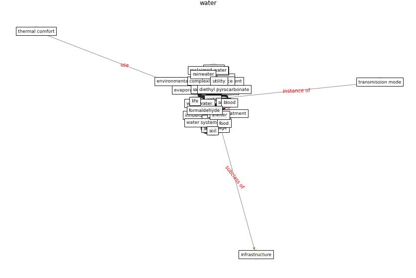

# Keyword: water

* [wastewater-sars](cluster_Cluster_5)

## Keywords

 * Cluster_5, advance contact angle, [air](keyword_air), alcoholic, atmosphere, [bed](keyword_bed), biome, blood, blue space, complexity science, consumption, contr, cool tower, coronavirus removal, [covid-19](keyword_covid-19), deionize, demineralise, di, diethyl pyrocarbonate, [disinfection](keyword_disinfection), drink water, [droplet](keyword_droplet), ecosystem, elute, [energy](keyword_energy), environmental resource management, essential service, ethanol, evaporative cooling, fluid, [food](keyword_food), [formaldehyde](keyword_formaldehyde), fountain, greywater, [horizon](keyword_horizon), hot water, hotdenmark, hydrogen, immersion in water, influenza a, land, landscape, legislative constraint, life, methanol, molecule, natural element, nourishment, pool, [research](keyword_research), [resource](keyword_resource), [risk](keyword_risk), rnase, salt, sanitary innovation, sanitary ware, sanitation, saturation vapour pressure, separate greywater, septic tank, [service](keyword_service), [sewage](keyword_sewage), sewer, shelter, soap, soil, solid waste, solubility, solute, steam, survival, synergetic effect, thermal, [thermal comfort](keyword_thermal_comfort), [toluene](keyword_toluene), transmission mode, utility, uv disinfection, valencia, vapour, vapour pressure, viscosity, vwc, [waste](keyword_waste), waste and wastewater management, [wastewater](keyword_wastewater), wastewater management, wastewater treatment, [water](keyword_water), water fingerprinting, water management, water neutral, water neutrality, water re, water source, water storage, water system, water treatment, waters, weather

## Concepts

 

## Neighbours

### Closest articles

* How is COVID-19 Experience Transforming Sustainability Requirements of Residential Buildings? A Review - [LINK](article_tokazhanov_how_2020)
* Mechanistic insights into the effect of humidity on airborne influenza virus survival, transmission and incidence - [LINK](article_marr_mechanistic_2019)
* Characterization and performance evaluation of a full-scale activated carbon-based dynamic botanical air filtration system for improving indoor air quality - [LINK](article_wang_characterization_2011)
* When the fourth water and digital revolution encountered COVID-19 - [LINK](article_poch_when_2020)
* Biophilic design in architecture and its contributions to health, well-being, and sustainability: A critical review - [LINK](article_zhong_biophilic_2022)
* An environmental and health perspective for COVID-19 outbreak: Meteorology and air quality influence, sewage epidemiology indicator, hospitals disinfection, drug therapies and recommendations - [LINK](article_barcelo_environmental_2020)
* Assessment method for new sustainability indicators providing pandemic resilience for residential buildings - [LINK](article_tokazhanov_assessment_2021)
* Learning from pandemics: Applying resilience thinking to identify priorities for planning urban settlements - [LINK](article_syal_learning_2021)
* Disinfection technology of hospital wastes and wastewater: Suggestions for disinfection strategy during coronavirus Disease 2019 (COVID-19) pandemic in China - [LINK](article_wang_disinfection_2020)
* Detection of SARS-CoV-2 in raw and treated wastewater in Germany – Suitability for COVID-19 surveillance and potential transmission risks - [LINK](article_westhaus_detection_2021)

### Closest BPs

