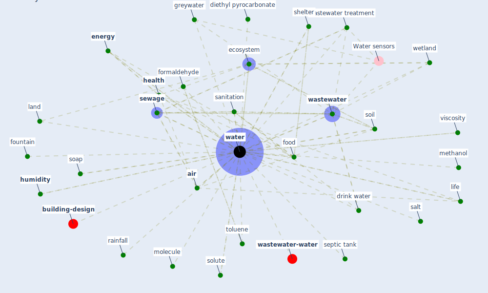

# Keyword: water

* [building-energy](cluster_2)

* [water-wastewater](cluster_7)

## Keywords

 * Cluster_2, [air](keyword_air), atmosphere, bed, biome, blood, blue space, complexity science, consumption, contr, cool tower, coronavirus removal, [covid-19](keyword_covid-19), deionize, demineralise, di, diethyl pyrocarbonate, [disinfection](keyword_disinfection), drink water, [droplet](keyword_droplet), ecology, [ecosystem](keyword_ecosystem), elute, [energy](keyword_energy), ethanol, evaporative cooling, fluid, food, food security, [formaldehyde](keyword_formaldehyde), fountain, fuel, greywater, [health](keyword_health), heat, heat stress, hot water, [humidity](keyword_humidity), [influent](keyword_influent), influenza a, irrigation, land, landscape, legislative constraint, life, methanol, molecule, nourishment, pond, rainfall, rnase, salt, sanitary innovation, sanitary ware, [sanitation](keyword_sanitation), sanitation and hygiene, saturation vapour pressure, [sector](keyword_sector), separate greywater, septic tank, [service](keyword_service), [sewage](keyword_sewage), [sewer](keyword_sewer), shelter, soap, soil, solid waste, solubility, solute, stagnant water, survival, synergetic effect, thermal, [toluene](keyword_toluene), transmission mode, [utility](keyword_utility), uv disinfection, valencia, vapour, vapour pressure, vegetation, vegetation cover, viscosity, vwc, waste, waste and wastewater management, [wastewater](keyword_wastewater), wastewater management, wastewater treatment, [water](keyword_water), water fingerprinting, water management, water re, water source, water storage, water system, water treatment, waters, weather, [wetland](keyword_wetland)

## Mapping

## Neighbours

### Closest articles

* How is COVID-19 Experience Transforming Sustainability Requirements of Residential Buildings? A Review - [LINK](article_tokazhanov_how_2020)
* Characterization and performance evaluation of a full-scale activated carbon-based dynamic botanical air filtration system for improving indoor air quality - [LINK](article_wang_characterization_2011)
* Mechanistic insights into the effect of humidity on airborne influenza virus survival, transmission and incidence - [LINK](article_marr_mechanistic_2019)
* When the fourth water and digital revolution encountered COVID-19 - [LINK](article_poch_when_2020)
* Decision Making within the Built Environment as a Strategy for Mitigating the Risk of Malaria and Other Vector-Borne Diseases - [LINK](article_obonyo_decision_2018)
* Assessment method for new sustainability indicators providing pandemic resilience for residential buildings - [LINK](article_tokazhanov_assessment_2021)
* An environmental and health perspective for COVID-19 outbreak: Meteorology and air quality influence, sewage epidemiology indicator, hospitals disinfection, drug therapies and recommendations - [LINK](article_barcelo_environmental_2020)
* Learning from pandemics: Applying resilience thinking to identify priorities for planning urban settlements - [LINK](article_syal_learning_2021)
* Addressing vulnerability, building resilience: community-based adaptation to vector-borne diseases in the context of global change - [LINK](article_bardosh_addressing_2017)
* SARS-CoV-2 RNA in wastewater anticipated COVID-19 occurrence in a low prevalence area - [LINK](article_randazzo_sars-cov-2_2020)

### Closest BPs

