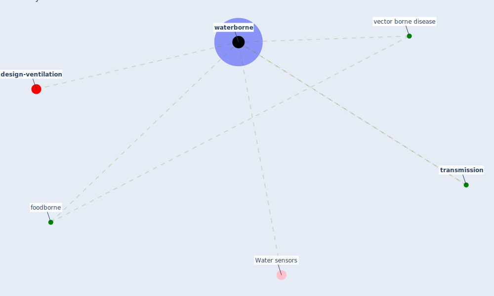

# Keyword: waterborne

* [design-ventilation](cluster_12)

## Keywords

 * Cluster_12, Water sensors, foodborne, [transmission](keyword_transmission), [vector borne disease](keyword_vector_borne_disease), [waterborne](keyword_waterborne)

## Mapping

## Neighbours

### Closest articles

* A Review on Building Design as a Biomedical System for Preventing COVID-19 Pandemic - [LINK](article_amran_review_2022)
* Learning from pandemics: Applying resilience thinking to identify priorities for planning urban settlements - [LINK](article_syal_learning_2021)
* First detection of SARS-CoV-2 in untreated wastewaters in Italy - [LINK](article_la_rosa_first_2020)

### Closest BPs

