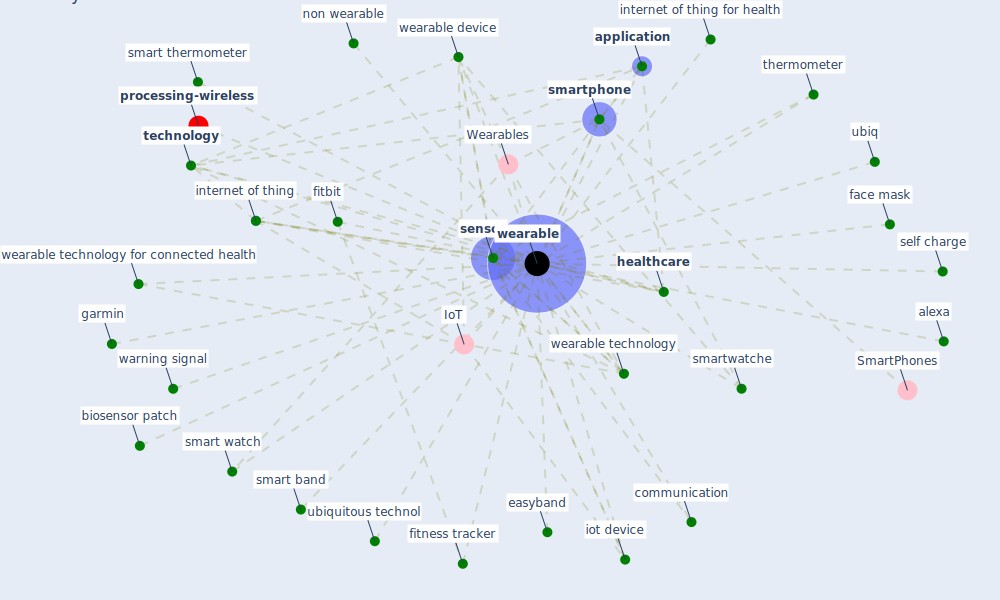

# Keyword: wearable

* [processing-wireless](cluster_14)

## Keywords

 * Cluster_14, IoT, Wearables, alexa, alxa, [application](keyword_application), battery life, beacon, biosensor patch, communication, contact trace, [device](keyword_device), easyband, edge ai, energy harvesting sensor, face mask, fitbit, fitness tracker, fitness wearable, garmin, [healthcare](keyword_healthcare), healthcare device, heart rate sensor, [internet of thing](keyword_internet_of_thing), internet of thing for health, [iot](keyword_iot), iot device, monitor patient from a remote location, non wearable, self charge, [sensor](keyword_sensor), [smart](keyword_smart), smart band, smart thermometer, smart watch, [smartphone](keyword_smartphone), smartwatche, [technology](keyword_technology), thermometer, ubiq, ubiquitous technol, warning signal, [wearable](keyword_wearable), wearable device, wearable technology, wearable technology for connected health, wearable wearable, wearables, whoop strap

## Mapping

## Neighbours

### Closest articles

* Impact of COVID-19 on IoT Adoption in Healthcare, Smart Homes, Smart Buildings, Smart Cities, Transportation and Industrial IoT - [LINK](article_umair_impact_2021)
* A Comprehensive Review of the COVID-19 Pandemic and the Role of IoT, Drones, AI, Blockchain, and 5G in Managing its Impact - [LINK](article_chamola_comprehensive_2020)
* The role of 5G for digital healthcare against COVID-19 pandemic: Opportunities and challenges - [LINK](article_siriwardhana_role_2021)
* Contributions of Smart City Solutions and Technologies to Resilience against the COVID-19 Pandemic: A Literature Review - [LINK](article_sharifi_contributions_2021)
* Health, Wellbeing \& Productivity in Offices - [LINK](article_world_green_building_council_health_2014)
* On the Coronavirus (COVID-19) Outbreak and the Smart City Network: Universal Data Sharing Standards Coupled with Artificial Intelligence (AI) to Benefit Urban Health Monitoring and Management - [LINK](article_allam_coronavirus_2020)
* 2020 Data Protection Report - [LINK](article_council_of_europe_2020_2020)
* Ten questions concerning occupant health in buildings during normal operations and extreme events including the COVID-19 pandemic - [LINK](article_awada_ten_2021)
* Learning from the COVID-19 pandemic in governing smart cities - [LINK](article_bolivar_learning_2022)

### Closest BPs

