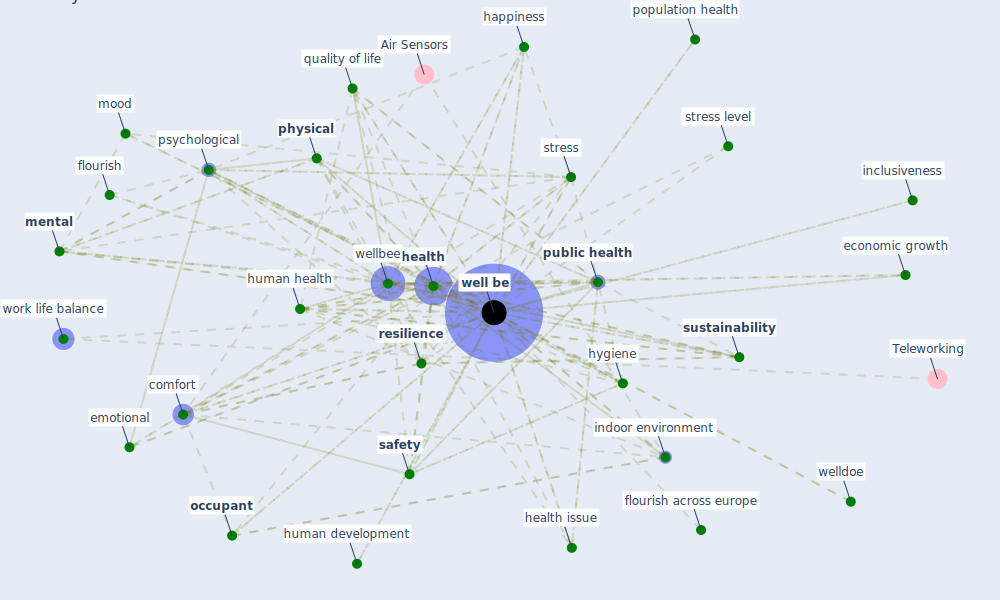

# Keyword: well be

## Keywords

 * affect, [anxiety](keyword_anxiety), benefit, [biomarker](keyword_biomarker), build hygiene, build structure, [building](keyword_building), [city](keyword_city), cognitive performance, comfort, [community](keyword_community), community health, concern, contemplating, continuous measure, cue, disorder, economic growth, economic measure, emotional, [employee](keyword_employee), employee health, equity, ess well be, ess well be module, eudaimonic, feel, [flourish](keyword_flourish), flourish across europe, [gardening](keyword_gardening), general, [green space](keyword_green_space), happiness, healing space, [health](keyword_health), health and wellness, [health care](keyword_health_care), health issue, health outcome, health status, healthy life, human development, [human health](keyword_human_health), hygiene, inclusiveness, [indoor environment](keyword_indoor_environment), indoor plant, inhabitant, intervention, lifestyle, [mental](keyword_mental), mood, nature base activity, [occupant](keyword_occupant), outdoor activity, pandemic process, perceive health, phrase, [physical](keyword_physical), place, population health, positive, positive psychology, priority, psycho logical, [psychological](keyword_psychological), [public health](keyword_public_health), quality of life, [resilience](keyword_resilience), resilient, restorative, [risk](keyword_risk), [safety](keyword_safety), sdg 3, sectoral, sociability, [social](keyword_social), societal, spiritual, [stress](keyword_stress), stress level, subjective, [sustainability](keyword_sustainability), sustainability of work, [sustainable development](keyword_sustainable_development), sustainable path, [symptom](keyword_symptom), system resilience, [urban green space](keyword_urban_green_space), user health, [well](keyword_well), [well be](keyword_well_be), well be trajectory, well being, [wellbee](keyword_wellbee), wellbeing, welldoe, work design, work life balance, work performance

## Mapping

## Neighbours

### Closest articles

* Strengthening resilience: a priority shared by Health 2020 and - [LINK](article_who_strengthening_2017)
* Occupant health in buildings: Impact of the COVID-19 pandemic on the opinions of building professionals and implications on research - [LINK](article_awada_occupant_2022)
* Mental health economics: A prospective study on psychological flourishing and associations with healthcare costs and sickness benefit transfers in Denmark - [LINK](article_santini_mental_2021)
* Sustainable work throughout the life course: National policies and strategies, Publications Office of the European Union - [LINK](article_eurofund_sustainable_2016)
* Biophilic design in architecture and its contributions to health, well-being, and sustainability: A critical review - [LINK](article_zhong_biophilic_2022)
* Association between indoor-outdoor green features and psychological health during the COVID-19 lockdown in Italy: A cross-sectional nationwide study - [LINK](article_spano_association_2021)
* Readiness Assessment of Green Building Certification Systems for Residential Buildings during Pandemics - [LINK](article_tleuken_readiness_2021)
*  - [LINK](article_dalessandro_covid-19_2020)
* Urban Green Infrastructure and Green Open Spaces: An Issue of Social Fairness in Times of COVID-19 Crisis - [LINK](article_reinwald_urban_2021)
* The impact of the COVID-19 pandemic on the importance of urban green spaces to the public - [LINK](article_noszczyk_impact_2022)

### Closest BPs

