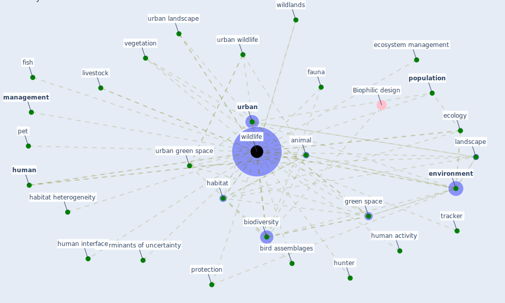

# Keyword: wildlife

## Keywords

 * animal, [biodiversity](keyword_biodiversity), bird assemblages, conservation, determinants of uncertainty, ecology, ecosystem management, [environment](keyword_environment), fauna, fish, [green space](keyword_green_space), habitat, habitat heterogeneity, [human](keyword_human), human activity, human interface, hunter, landscape, livestock, [management](keyword_management), pet, [population](keyword_population), protection, tracker, [urban](keyword_urban), [urban green space](keyword_urban_green_space), urban landscape, urban wildlife, vegetation, wildlands, [wildlife](keyword_wildlife), zoonotic

## Mapping

## Neighbours

### Closest articles

* Green infrastructure through the lens of “One Health”: A systematic review and integrative framework uncovering synergies and trade-offs between mental health and wildlife support in cities - [LINK](article_felappi_green_2020)
* Nurture to nature via COVID-19, a self-regenerating environmental strategy of environment in global context - [LINK](article_paital_nurture_2020)
* Building sustainable finance for resilient protected and conserved areas: lessons from COVID-19 - [LINK](article_cumming_building_2021)
* Making green infrastructure healthier infrastructure - [LINK](article_lohmus_making_2015)
* Navigating Climate Change: Rethinking the Role of Buildings - [LINK](article_cole_navigating_2020)
* The Role of Architecture and Urbanism in Preventing Pandemics - [LINK](article_kumar_role_2021)
* Learning from pandemics: Applying resilience thinking to identify priorities for planning urban settlements - [LINK](article_syal_learning_2021)
* Addressing vulnerability, building resilience: community-based adaptation to vector-borne diseases in the context of global change - [LINK](article_bardosh_addressing_2017)
* Building up an ecologically sustainable and socially desirable post-COVID-19 future - [LINK](article_duflot_building_2021)
* How COVID-19 Redefines the Concept of Sustainability - [LINK](article_hakovirta_how_2020)

### Closest BPs

