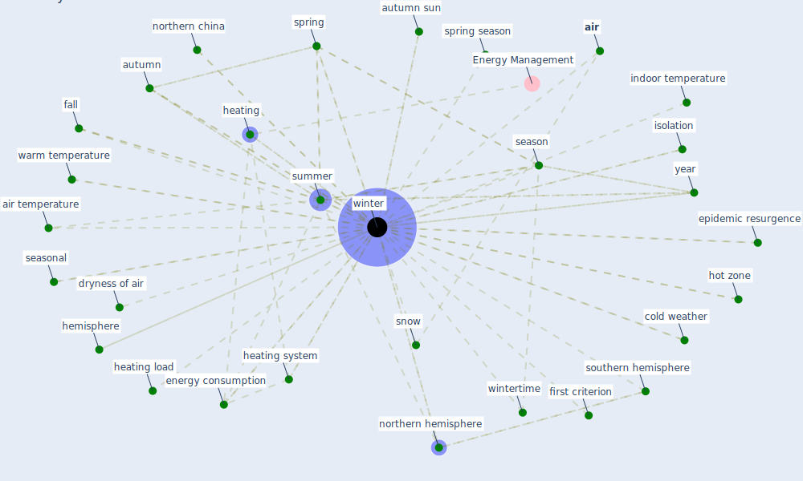

# Keyword: winter

## Keywords

 * [air](keyword_air), air temperature, autumn, autumn sun, [climate](keyword_climate), cold weather, dryness of air, [energy consumption](keyword_energy_consumption), [epidemic](keyword_epidemic), epidemic resurgence, fall, heating, heating load, heating system, hemisphere, hot zone, indoor temperature, isolation, northern china, northern hemisphere, season, seasonal, snow, southern hemisphere, spring, spring season, summer, [united states](keyword_united_states), warm temperature, warm weather, [winter](keyword_winter), winters, wintertime, wintertime heating season, [year](keyword_year), first criterion

## Mapping

## Neighbours

### Closest articles

* The effect of occupant distribution on energy consumption and COVID-19 infection in buildings: A case study of university building - [LINK](article_mokhtari_effect_2021)
* An Intelligent IEQ Monitoring and Feedback System: Development and Applications - [LINK](article_geng_intelligent_2021)
* Climate and the spread of COVID-19 - [LINK](article_chen_climate_2021)
* Health, Wellbeing \& Productivity in Offices - [LINK](article_world_green_building_council_health_2014)
* The Effect of Opening Windows on Air Change Rates in Two Homes - [LINK](article_howard-reed_effect_2002)
* The ventilation of buildings and other mitigating measures for COVID-19: a focus on wintertime - [LINK](article_burridge_ventilation_2021)
* COVID-19 could be a seasonal illness with higher risk in winter: Reduced humidity linked to increased COVID-19 risk - [LINK](article_university_of_sydney_covid-19_2020)
* Characterization and performance evaluation of a full-scale activated carbon-based dynamic botanical air filtration system for improving indoor air quality - [LINK](article_wang_characterization_2011)
* A critical review of heating, ventilation, and air conditioning (HVAC) systems within the context of a global SARS-CoV-2 epidemic - [LINK](article_elsaid_critical_2021)
* COVID19-Routes: A Safe Pedestrian Navigation Service - [LINK](article_cantarero_covid19-routes_2021)

### Closest BPs

