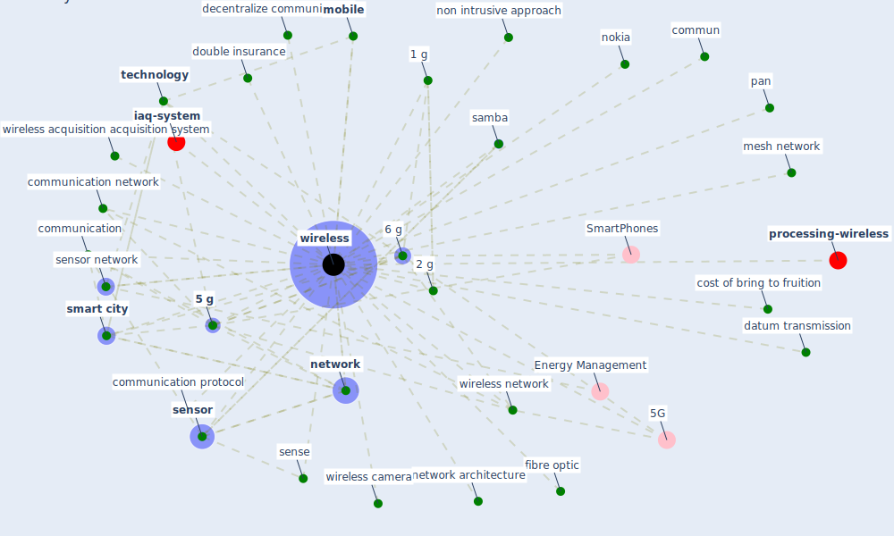

# Keyword: wireless

* [processing-wireless](cluster_3)

* [iaq-system](cluster_14)

## Keywords

 * 1 g, 2 g, 3 g, 4 g, [5 g](keyword_5_g), 5 ghz, 5G, [6 g](keyword_6_g), Cluster_14, Cluster_3, [bluetooth](keyword_bluetooth), commun, communication, communication network, communication protocol, cost of bring to fruition, datum transmission, decentralize communication, double insurance, fibre optic, mesh network, [mobile](keyword_mobile), [network](keyword_network), network architecture, nokia, non intrusive approach, pan, [samba](keyword_samba), sense, [sensor](keyword_sensor), sensor network, [smart city](keyword_smart_city), [technology](keyword_technology), [wireless](keyword_wireless), wireless acquisition acquisition system, wireless camera, wireless network, wireless wireless acquisition acquisition system

## Mapping

## Neighbours

### Closest articles

* Future (post-COVID) digital, smart and sustainable cities in the wake of 6G: Digital twins, immersive realities and new urban economies - [LINK](article_allam_future_2021)
* Scalable IoT Architecture for Monitoring IEQ Conditions in Public and Private Buildings - [LINK](article_calvo_scalable_2022)
* Continuous IEQ monitoring system: Context and development - [LINK](article_parkinson_continuous_2019)
* A comprehensive review on indoor air quality monitoring systems for enhanced public health - [LINK](article_saini_comprehensive_2020)
* Mobile Technology Solution for COVID-19: Surveillance and Prevention - [LINK](article_raza_mobile_2021)
* An Intelligent IEQ Monitoring and Feedback System: Development and Applications - [LINK](article_geng_intelligent_2021)
* The role of 5G for digital healthcare against COVID-19 pandemic: Opportunities and challenges - [LINK](article_siriwardhana_role_2021)
*  - [LINK](article_mehtab_alam_role_2021)
* Social distancing enhanced automated optimal design of physical spaces in the wake of the COVID-19 pandemic - [LINK](article_ugail_social_2021)

### Closest BPs

