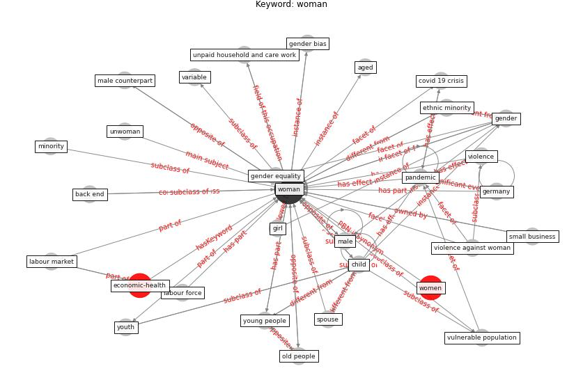

# Keyword: woman

* [health-pca](cluster_Cluster_9)

## Keywords

 * Cluster_9, aged, back end, child, [covid 19 crisis](keyword_covid_19_crisis), disadvantaged group, [economic](keyword_economic), ethnic minority, [europe](keyword_europe), family, family responsibility, feminisation of poverty, gender, gender bias, gender equality, [germany](keyword_germany), girl, [health](keyword_health), high education, java, labour force, [labour market](keyword_labour_market), male, male counterpart, minority, old people, [pandemic](keyword_pandemic), racial minority, small business, social consequence, spouse, unpaid household and care work, unwoman, variable, [violence](keyword_violence), violence against woman, vulnerable population, [woman](keyword_woman), women, young people, youth

## Concepts

 

## Neighbours

### Closest articles

* Sustainable work throughout the life course: National policies and strategies, Publications Office of the European Union - [LINK](article_eurofund_sustainable_2016)
* Urban planning after COVID-19 - [LINK](article_rtpi_urban_2021)
* The impacts of knowledge, risk perception, emotion and information on citizens’ protective behaviors during the outbreak of COVID-19: a cross-sectional study in China - [LINK](article_ning_impacts_2020)
* Health, Economic and Social Development Challenges of the COVID-19 Pandemic: Strategies for Multiple and Interconnected Issues - [LINK](article_panneer_health_2022)
* World Bank Development Report - [LINK](article_world_bank_world_2022)
* The COVID-19 pandemic: Lessons on building more equal and sustainable societies - [LINK](article_van_barneveld_covid-19_2020)
* COVID-19: IMPACT OF THE PANDEMIC ON THE SUSTAINABLE DEVELOPMENT GOALS - [LINK](article_samout_covid-19_2020)
* Addressing vulnerability, building resilience: community-based adaptation to vector-borne diseases in the context of global change - [LINK](article_bardosh_addressing_2017)
* The Impact of COVID-19 on Public Space: A Review of the Emerging Questions - [LINK](article_honey-roses_impact_2020)
* COVID-19 and the rise of intimate partner violence - [LINK](article_aguero_covid-19_2021)

### Closest BPs

