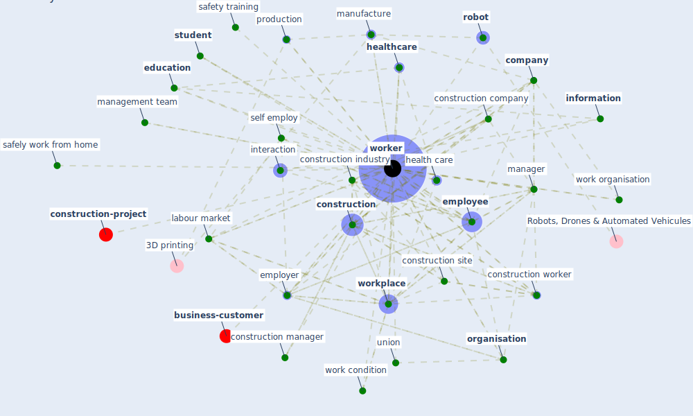

# Keyword: worker

* [construction-project](cluster_8)

* [business-customer](cluster_11)

## Keywords

 * Cluster_11, Cluster_8, amazon, [attitude](keyword_attitude), casual, ceo, [company](keyword_company), [construction](keyword_construction), construction company, construction firm, [construction industry](keyword_construction_industry), construction manager, construction project, construction site, [construction worker](keyword_construction_worker), [covid 19 pandemic](keyword_covid_19_pandemic), direct patient contact, disable, driver, [education](keyword_education), [employee](keyword_employee), [employer](keyword_employer), employment status, fulltime, group, [health care](keyword_health_care), [healthcare](keyword_healthcare), [household](keyword_household), indian, [information](keyword_information), [interaction](keyword_interaction), job specific educatient, [labour market](keyword_labour_market), machinery, management team, [manager](keyword_manager), [manufacture](keyword_manufacture), meat factory, [office](keyword_office), office space, [organisation](keyword_organisation), [organization](keyword_organization), [patient](keyword_patient), production, [productivity](keyword_productivity), remote working, [robot](keyword_robot), safely work from home, [safety](keyword_safety), safety standard, safety training, secondary labour market, self employ, [stress](keyword_stress), [student](keyword_student), take time off work, union, vulnerable, white collar, work condition, work from home, work hour, work organisation, [worker](keyword_worker), workers, [workplace](keyword_workplace)

## Mapping

## Neighbours

### Closest articles

* Sustainable work throughout the life course: National policies and strategies, Publications Office of the European Union - [LINK](article_eurofund_sustainable_2016)
* COVID-19 Experience Transforming the Protective Environment of Office Buildings and Spaces - [LINK](article_phapant_covid-19_2021)
* Influence between COVID-19 Impacts and Project Stakeholders in Chilean Construction Projects - [LINK](article_araya_influence_2021)
* Guidelines for Responding to COVID-19 Pandemic: Best Practices, Impacts, and Future Research Directions - [LINK](article_assaad_guidelines_2021)
* Strategies to Mitigate COVID-19 Pandemic Impacts on Health and Safety of Workers in Construction Projects - [LINK](article_kaushal_strategies_2021)
* Health, Wellbeing \& Productivity in Offices - [LINK](article_world_green_building_council_health_2014)
* The Effects of Pandemic on Construction Industry in the UK - [LINK](article_shibani_effects_2020)
* Impacts of COVID-19 on Health and Safety of Workforce in Construction Industry - [LINK](article_pamidimukkala_impacts_2021)
* The COVID-19 pandemic: Lessons on building more equal and sustainable societies - [LINK](article_van_barneveld_covid-19_2020)
* Propositions for a Resilient, Post-COVID-19 Future for the AEC Industry - [LINK](article_nassereddine_propositions_2021)

### Closest BPs

