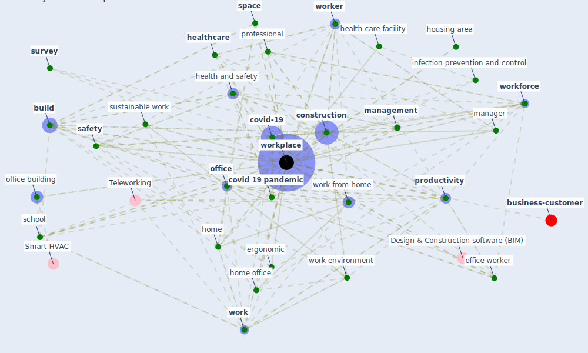

# Keyword: workplace

* [business-customer](cluster_11)

## Keywords

 * [attitude](keyword_attitude), basic infection prevention measure, [biophilic](keyword_biophilic), [build](keyword_build), [business](keyword_business), call center, category, collaboration, [community](keyword_community), conference room, [construction](keyword_construction), [construction industry](keyword_construction_industry), context, [covid 19 pandemic](keyword_covid_19_pandemic), [covid-19](keyword_covid-19), cre portfolio, diversity, effective control measure, [employee](keyword_employee), [employer](keyword_employer), employer regulation, employment condition, engineering control, ergonomic, [factory](keyword_factory), flexible space, hazard, [health and safety](keyword_health_and_safety), health care facility, health safety, health wellbeing productivity in office, [healthcare](keyword_healthcare), high occupancy area, [home](keyword_home), home office, hot desk, housing area, infection prevention, [infection prevention and control](keyword_infection_prevention_and_control), [labour market](keyword_labour_market), [management](keyword_management), [manager](keyword_manager), modern, [office](keyword_office), office building, office manager, office worker, post-pandemic, [practice](keyword_practice), [productivity](keyword_productivity), [professional](keyword_professional), protect worker, protectse worker, protocol design to prevent disease transmission, public building, regulatory framework, [remote work](keyword_remote_work), require ment, [resilience](keyword_resilience), restaurant, return to work, risk assessment, role, safe management, safe return, safe return of worker, [safety](keyword_safety), safety and health control, sanitize, [school](keyword_school), sector of elevated risk, seniority, [space](keyword_space), [survey](keyword_survey), [sustainable work](keyword_sustainable_work), touchless, transport station, [vulnerability](keyword_vulnerability), water utility, [window](keyword_window), window view, [work](keyword_work), work and place, work condition, work day, work environment, work from home, work location, work practice, work sustainable, [worker](keyword_worker), worker safety, [workforce](keyword_workforce), workfrom home, [workplace](keyword_workplace), workplace facility, workplace health and safety, [workplace management](keyword_workplace_management), workplace modification, workplace preference

## Mapping

## Neighbours

### Closest articles

* COVID-19 Experience Transforming the Protective Environment of Office Buildings and Spaces - [LINK](article_phapant_covid-19_2021)
* A study on office workplace modification during the COVID-19 pandemic in The Netherlands - [LINK](article_hou_study_2021)
* Health, Wellbeing \& Productivity in Offices - [LINK](article_world_green_building_council_health_2014)
* Sustainable work throughout the life course: National policies and strategies, Publications Office of the European Union - [LINK](article_eurofund_sustainable_2016)
* Analysis of COVID-19 Concerns Raised by the Construction Workforce and Development of Mitigation Practices - [LINK](article_bou_hatoum_analysis_2021)
* COVID-19 Prevention and Control Measures in Workplace Settings: A Rapid Review and Meta-Analysis - [LINK](article_ingram_covid-19_2021)
* Adaptive Design of the Built Environment to Mitigate the Transmission Risk of COVID-19 - [LINK](article_ara_dilshad_shangi_adaptive_2020)
* The COVID-19 Impact on Flexible Office Space - [LINK](article_clifton_covid-19_2020)
* Impacts of COVID-19 on Health and Safety of Workforce in Construction Industry - [LINK](article_pamidimukkala_impacts_2021)
* COVID-19: Risk assessment and mitigation measures in healthcare and non-healthcare workplaces - [LINK](article_fawzy_covid-19_2021)

### Closest BPs

