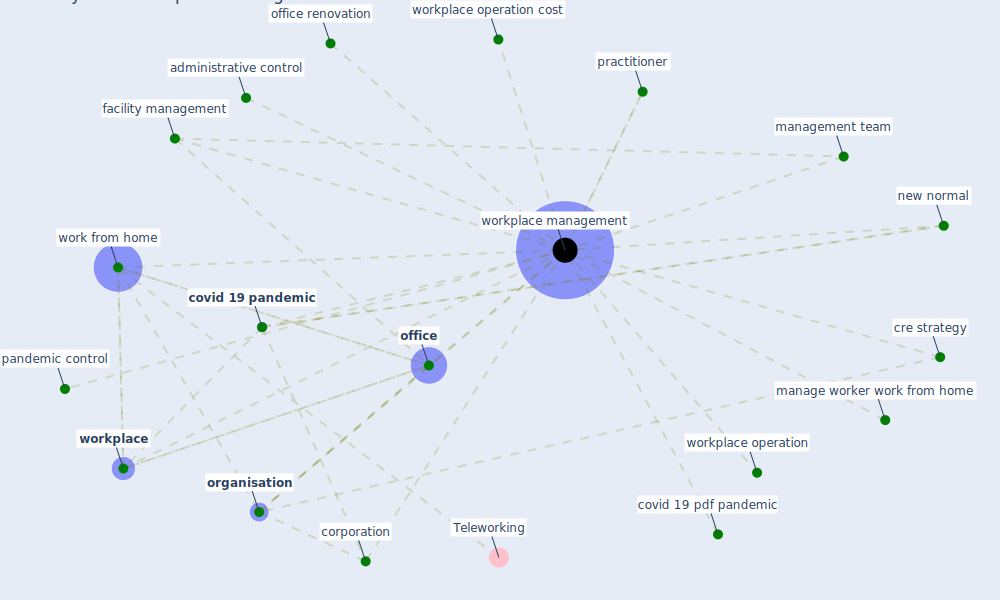

# Keyword: workplace management

## Keywords

 * administrative control, corporation, [covid 19 pandemic](keyword_covid_19_pandemic), covid 19 pdf pandemic, cre strategy, [facility management](keyword_facility_management), manage worker work from home, management team, new normal, [office](keyword_office), office renovation, [organisation](keyword_organisation), pandemic control, practitioner, work from home, [workplace](keyword_workplace), [workplace management](keyword_workplace_management), workplace operation, workplace operation cost

## Mapping

## Neighbours

### Closest articles

* A study on office workplace modification during the COVID-19 pandemic in The Netherlands - [LINK](article_hou_study_2021)

### Closest BPs

