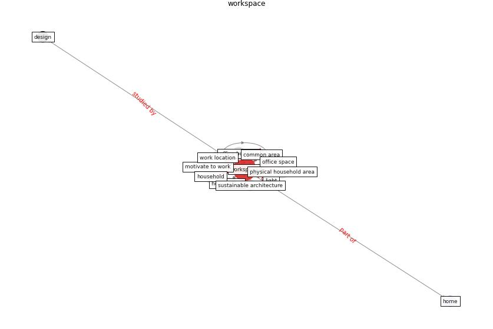

# Keyword: workspace

* [space-flexible](cluster_Cluster_14)

## Keywords

 * Cluster_14, activity base, [design](keyword_design), [employee](keyword_employee), [home](keyword_home), home office, [house](keyword_house), [household](keyword_household), [housing](keyword_housing), [indoor](keyword_indoor), interaction, internet access, light, motivate to work, office building, office space, physical household area, [sustainable architecture](keyword_sustainable_architecture), work location, [workspace](keyword_workspace), workspaces

## Concepts

 

## Neighbours

### Closest articles

* Prophylactic Architecture: Formulating the Concept of Pandemic-Resilient Homes - [LINK](article_elrayies_prophylactic_2022)
* Adaptive Design of the Built Environment to Mitigate the Transmission Risk of COVID-19 - [LINK](article_ara_dilshad_shangi_adaptive_2020)
* Antivirus-built environment: Lessons learned from Covid-19 pandemic - [LINK](article_megahed_antivirus-built_2020)
* Health, Wellbeing \& Productivity in Offices - [LINK](article_world_green_building_council_health_2014)
* Building up an ecologically sustainable and socially desirable post-COVID-19 future - [LINK](article_duflot_building_2021)
* COVID-19 Experience Transforming the Protective Environment of Office Buildings and Spaces - [LINK](article_phapant_covid-19_2021)
* How is COVID-19 Experience Transforming Sustainability Requirements of Residential Buildings? A Review - [LINK](article_tokazhanov_how_2020)
* Houses amid COVID-19: Environmental challenges and design adaptation - [LINK](article_hizra_houses_2021)
* Occupant health in buildings: Impact of the COVID-19 pandemic on the opinions of building professionals and implications on research - [LINK](article_awada_occupant_2022)

### Closest BPs

