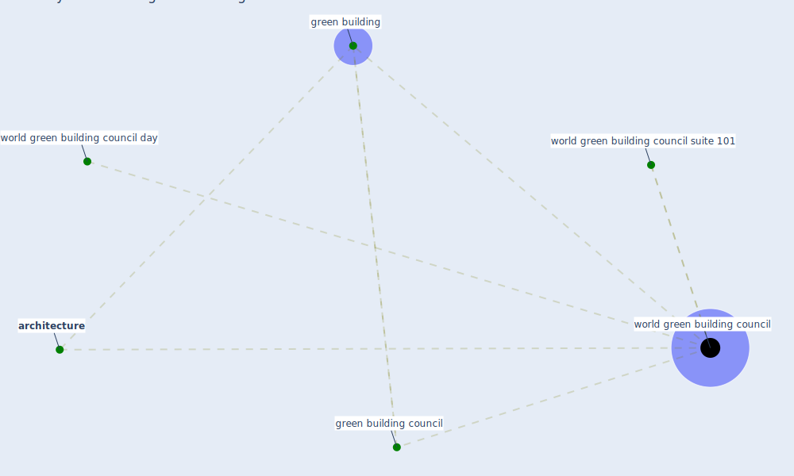

# Keyword: world green building council

## Keywords

 * [architecture](keyword_architecture), [green building](keyword_green_building), green building council, [world green building council](keyword_world_green_building_council), world green building council day, world green building council suite 101

## Mapping

## Neighbours

### Closest articles

* The contribution of green buildings in the fight against COVID-19 - [LINK](article_world_green_building_council_contribution_2020)
* Continuous IEQ monitoring system: Context and development - [LINK](article_parkinson_continuous_2019)
* Biophilic design in architecture and its contributions to health, well-being, and sustainability: A critical review - [LINK](article_zhong_biophilic_2022)

### Closest BPs

