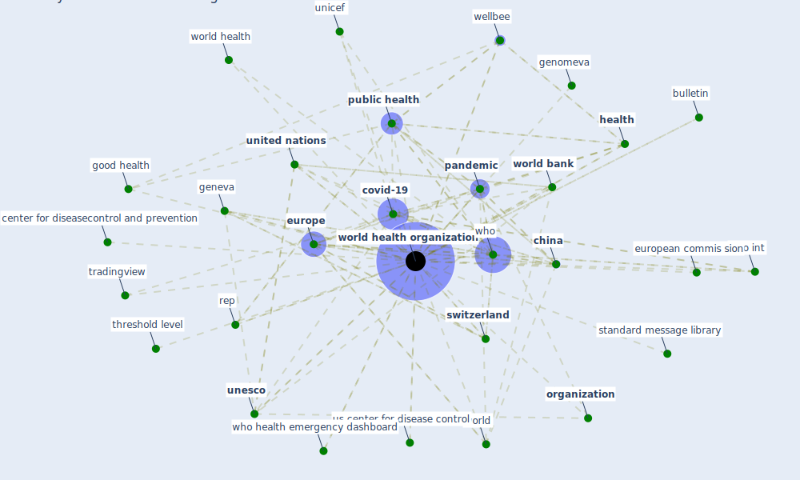

# Keyword: world health organization

## Keywords

 * 2009 guidance for infection control in healthcare setting, 98 7 484 494 bulletin, 98 7 484 494 bulletin of the world health organization, a paper contain guideline to follow and practice, a paper containingペguideline to follow and practice, almaata, anthropologist, app int, authoritative datum, b1, b3, bell dm, bueno air city, bulletin, ccdc, ccsdh, [cdc](keyword_cdc), center for disease control and prevention, center for diseasecontrol and prevention, center for diseasepostscontrol and prevention, centre for health development, [china](keyword_china), communicable infection, constitution of the world health organization 1995, copenhagen, [covid 19 pandemic](keyword_covid_19_pandemic), covid 19 virus, [covid-19](keyword_covid-19), [europe](keyword_europe), european commis sion, fpsyg, geneva, geneva org, geneva switzerland, genomeva, globalvector control response, good health, guideline for naturally ventilate building, [health](keyword_health), health and safety in the workplace, health development, healthy housing, human life, human life and work, johannesburg declaration, malaria report, mdgs sdgs, ministry of health, mipasa, naturally ventilate, naturally ventilate building, [organisation](keyword_organisation), organization, [pandemic](keyword_pandemic), paris, [policy](keyword_policy), [public health](keyword_public_health), public health agency, public health emergency, rep, response, restaurant accommodation hotel and motel, schema theory, shelter, shelter org uk, smart technology, standard message library, statistic, [switzerland](keyword_switzerland), the cdc, the pandemic, the world, the world health organization, threshold level, tradingview, [unesco](keyword_unesco), unicef, [united kingdom](keyword_united_kingdom), [united nations](keyword_united_nations), united nations children s fund, urban health initiative, us center for disease control, weekly report, [wellbee](keyword_wellbee), who, who be, who europe, who health emergency dashboard, who int, world, [world bank](keyword_world_bank), world healing day, world health, world health day, [world health organization](keyword_world_health_organization), world malaria report, worldwide, www who int, zeb zero energy building behavior

## Mapping

## Neighbours

### Closest articles

* A Comprehensive Review of the COVID-19 Pandemic and the Role of IoT, Drones, AI, Blockchain, and 5G in Managing its Impact - [LINK](article_chamola_comprehensive_2020)
* Decision Making within the Built Environment as a Strategy for Mitigating the Risk of Malaria and Other Vector-Borne Diseases - [LINK](article_obonyo_decision_2018)
* Strengthening resilience: a priority shared by Health 2020 and - [LINK](article_who_strengthening_2017)
* ASHRAE Position Document on Infectious Aerosols - [LINK](article_ashrae_ashrae_2022)
*  - [LINK](article_dalessandro_covid-19_2020)
* Green in times of COVID-19: urban green space relevance during the COVID-19 pandemic in Buenos Aires City - [LINK](article_marconi_green_2022)
* COVID-19 Could Leverage a Sustainable Built Environment - [LINK](article_pinheiro_covid-19_2020)
* COVID19-Routes: A Safe Pedestrian Navigation Service - [LINK](article_cantarero_covid19-routes_2021)
* Challenges to Mitigating the Urban Health Burden of Mosquito-Borne Diseases in the Face of Climate Change - [LINK](article_ligsay_challenges_2021)
* The changes in the effects of social media use of Cypriots due to COVID-19 pandemic - [LINK](article_kaya_changes_2020)

### Closest BPs

