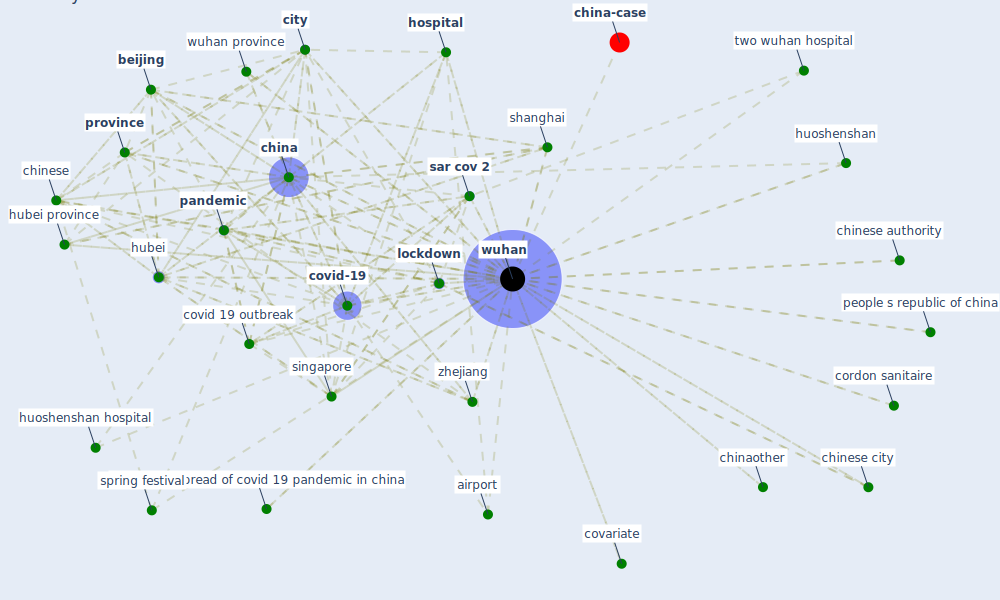

# Keyword: wuhan

## Keywords

 * [5 g](keyword_5_g), SARS-CoV-2, [air pollution](keyword_air_pollution), [airport](keyword_airport), bangkok, [beijing](keyword_beijing), cabin hospital, [china](keyword_china), chinaother, [chinese](keyword_chinese), chinese authority, chinese city, chinese new year, chinese province, citizen, [city](keyword_city), city lockdown, contagious, cordon sanitaire, [coronavirus](keyword_coronavirus), [coronavirus outbreak](keyword_coronavirus_outbreak), covariate, covid 19 epidemic, covid 19 outbreak, [covid 19 pandemic](keyword_covid_19_pandemic), covid 19 pandemic in china, covid 19 transmission dynamic, [covid-19](keyword_covid-19), [epidemic](keyword_epidemic), guangzhou, hendra, [hospital](keyword_hospital), hscw, hscw zone, huada biotechnology, huanan, [hubei](keyword_hubei), hubei province, huizhou, human movement, huoshenshan, huoshenshan hospital, [india](keyword_india), [japan](keyword_japan), jd com, jd logistics, jinpe, large scale spread of covid 19 pandemic in china, leishenshan, leishenshan hospital, lock down, [lockdown](keyword_lockdown), lombardy, mainland china, material and method, mobile cabin hospital, optics valley, other city, other place, outbreak in china, outbreak of corona virus, [pandemic](keyword_pandemic), people s republic of china, place in complete lockdown, [province](keyword_province), [railway station](keyword_railway_station), republic of china, [sar cov 2](keyword_sar_cov_2), seafood market, seafood wholesale market, [shanghai](keyword_shanghai), shanghai people s hospital, singapore, spring festival, [tempe](keyword_tempe), testing investigation and improvement on airquality in air conditioning bus, the pandemic, the situation, the virusbroke, thecoronavirus outbreak grow the city have, traffic in and out, traffic in and out of wuhan, train, travel history, travel restriction, travel restrictions in and out, two wuhan hospital, urban official, virusbroke, world, [wuhan](keyword_wuhan), wuhan city travel ban, wuhan huoshenshan hospital, wuhan province, wuhan shutdown, wuhan travel ban shutdown, wuhan university, zhejiang, first makeshift hospital, flight

## Mapping

## Neighbours

### Closest articles

* The effect of human mobility and control measures on the COVID-19 epidemic in China - [LINK](article_kraemer_effect_2020)
* An investigation of transmission control measures during the first 50 days of the COVID-19 epidemic in China - [LINK](article_tian_investigation_2020)
*  - [LINK](article_mehtab_alam_role_2021)
* Respiratory pandemics, urban planning and design: A multidisciplinary rapid review of the literature - [LINK](article_harris_respiratory_2022)
* Design COVID-19 Ontology: A Healthcare and Safety Perspective - [LINK](article_aloulou_design_2022)
* How the 5G Enabled the COVID-19 Pandemic Prevention and Control: Materiality, Affordance, and (De-)Spatialization - [LINK](article_li_how_2022)
* The COVID-19 pandemic: Impacts on cities and major lessons for urban planning, design, and management - [LINK](article_sharifi_covid-19_2020)
* A Comprehensive Review of the COVID-19 Pandemic and the Role of IoT, Drones, AI, Blockchain, and 5G in Managing its Impact - [LINK](article_chamola_comprehensive_2020)
* COVID-19 Higher Mortality in Chinese Regions With Chronic Exposure to Lower Air Quality - [LINK](article_pansini_covid-19_2021)
* Aerosol and Surface Distribution of Severe Acute Respiratory Syndrome Coronavirus 2 in Hospital Wards, Wuhan, China, 2020 - [LINK](article_guo_aerosol_2020)

### Closest BPs

