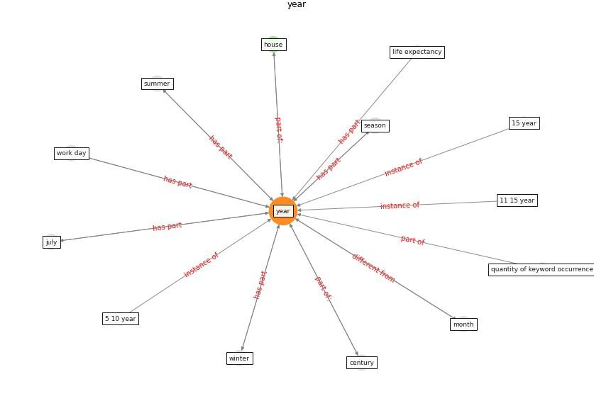

# Keyword: __year__
## Clusters

* Cluster 2: [construction-resilience](cluster_2.md)

## Concepts

 

## Articles
* carvalhaes_covid-19_2020-50 ([carvalhaes_covid-19_2020-50](article_carvalhaes_covid-19_2020-50.md))
* realdania_refleksioner_2022_EN-50 ([realdania_refleksioner_2022_EN-50](article_realdania_refleksioner_2022_EN-50.md))
* realdania_refleksioner_2022_EN-400 ([realdania_refleksioner_2022_EN-400](article_realdania_refleksioner_2022_EN-400.md))
* COVID19-Routes: A Safe Pedestrian Navigation
Service ([cantarero_covid19-routes_2021](article_cantarero_covid19-routes_2021.md))
* The effect of a redesigned floor plan, occupant density
and the quality of indoor climate on the cost of space,
productivity and sick leave in an office building–A
case study ([saari_effect_2006](article_saari_effect_2006.md))
* An Overview of Biomedical Ontologies for Pandemics
and Infectious Diseases Representation ([bayoudhi_overview_2021](article_bayoudhi_overview_2021.md))
* ogunnusi_covid-19_2020-100 ([ogunnusi_covid-19_2020-100](article_ogunnusi_covid-19_2020-100.md))
* Architectural Design Drives the Biogeography of
Indoor Bacterial Communities ([kembel_architectural_2014](article_kembel_architectural_2014.md))
* realdania_refleksioner_2022_EN-1750 ([realdania_refleksioner_2022_EN-1750](article_realdania_refleksioner_2022_EN-1750.md))
* Effects to Construction Project Management
Impacted Circular Economic of Covid-19 Pandemic ([paikan_effects_2021](article_paikan_effects_2021.md))
