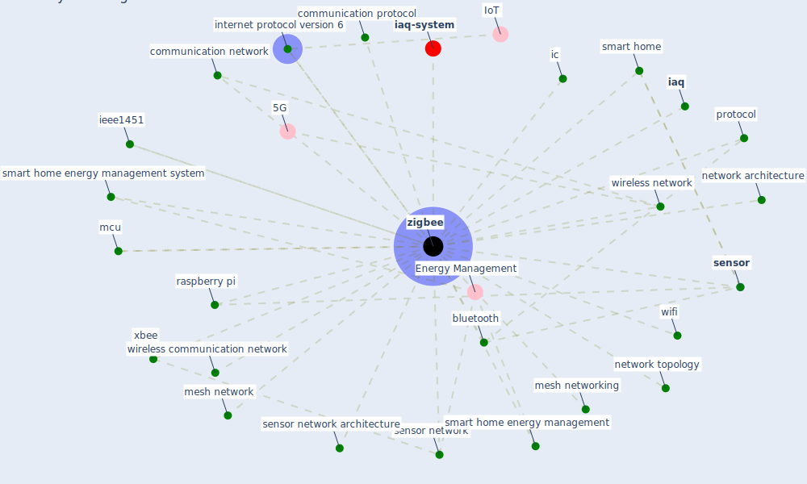

# Keyword: zigbee

* [iaq-system](cluster_3)

## Keywords

 * Cluster_3, [bluetooth](keyword_bluetooth), communication network, communication protocol, [iaq](keyword_iaq), ic, ieee1451, internet protocol version 6, mcu, mesh network, mesh networking, network architecture, network topology, [protocol](keyword_protocol), raspberry pi, [sensor](keyword_sensor), sensor network, sensor network architecture, smart home, smart home energy management, smart home energy management system, [wifi](keyword_wifi), wireless communication network, wireless network, xbee, [zigbee](keyword_zigbee)

## Mapping

## Neighbours

### Closest articles

* A comprehensive review on indoor air quality monitoring systems for enhanced public health - [LINK](article_saini_comprehensive_2020)
* Scalable IoT Architecture for Monitoring IEQ Conditions in Public and Private Buildings - [LINK](article_calvo_scalable_2022)
* Continuous IEQ monitoring system: Context and development - [LINK](article_parkinson_continuous_2019)
* An Intelligent IEQ Monitoring and Feedback System: Development and Applications - [LINK](article_geng_intelligent_2021)

### Closest BPs

