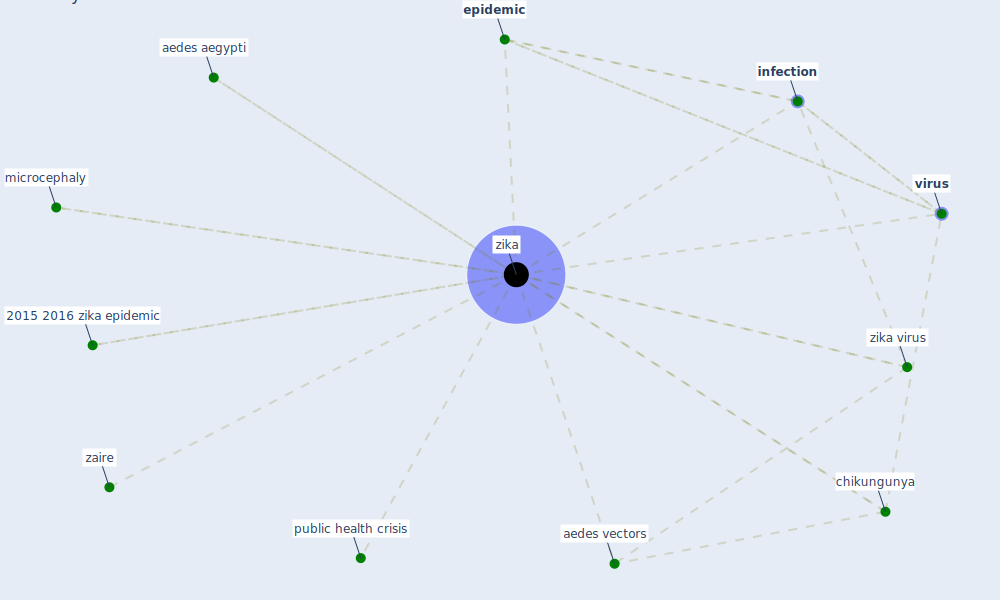

# Keyword: zika

## Keywords

 * 2015 2016 zika epidemic, aedes aegypti, aedes vectors, chikungunya, [epidemic](keyword_epidemic), [infection](keyword_infection), microcephaly, public health crisis, [virus](keyword_virus), zaire, [zika](keyword_zika), zika virus

## Mapping

## Neighbours

### Closest articles

* Global policy challenges for urban vector-borne disease risks - [LINK](article_alabaster_global_2016)
* Challenges to Mitigating the Urban Health Burden of Mosquito-Borne Diseases in the Face of Climate Change - [LINK](article_ligsay_challenges_2021)
* Addressing vulnerability, building resilience: community-based adaptation to vector-borne diseases in the context of global change - [LINK](article_bardosh_addressing_2017)
* Pandemic stricken cities on lockdown. Where are our planning and design professionals [now, then and into the future]? - [LINK](article_allam_pandemic_2020)
* Future perspectives of wastewater-based epidemiology: Monitoring infectious disease spread and resistance to the community level - [LINK](article_sims_future_2020)

### Closest BPs

